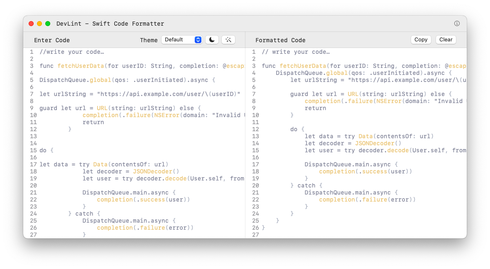
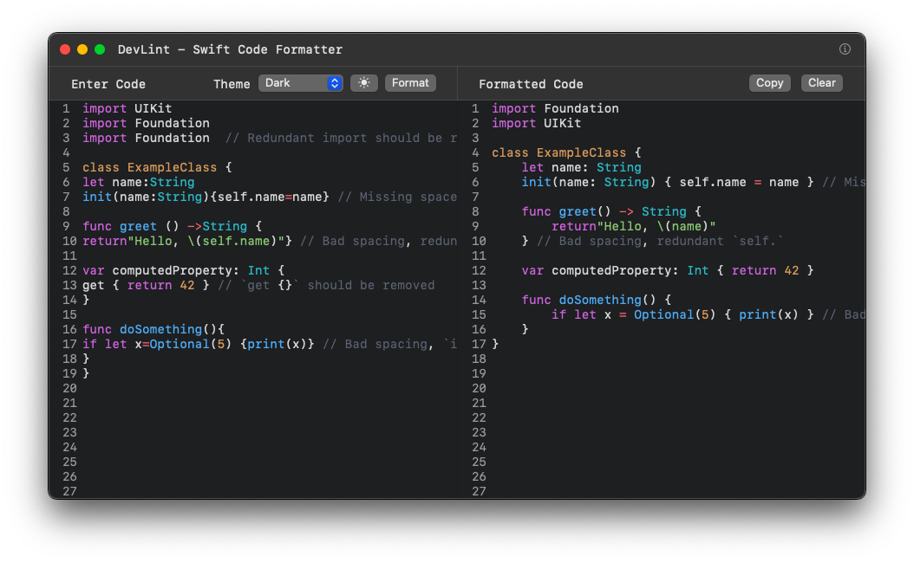

# DevLint 🚀  
DevLint is a lightweight, native macOS application designed to help developers format, lint, and correct Swift syntax effortlessly. The project is currently in development, aiming to provide a minimal yet efficient tool for Swift developers who want a clean, readable, and well-structured codebase.

> [!IMPORTANT]  
> I'm working on new features and improvements.
> Please try it out and report any issues!
> 
> Contributions are welcome! Feel free to submit PRs or open issues.  

## Preview

## 🛠 Current Features (In Progress)

- ✅ Basic Syntax Highlighting – Supports Swift keywords, types, operators, and comments.
- ✅ Editable Code Editor – A smooth, scrollable text editor with line numbering.
- ✅ Auto-Indentation & Formatting – Adjusts spacing and structure for better readability.
- ✅ Error Detection (Work in Progress) – Highlights syntax mistakes.
- ✅ Bracket Matching (Coming Soon) – Highlights matching {}, (), and [].

## 💪 Development Status

- The core editor is functional and supports syntax highlighting for Swift.
- Work in progress: Enhancing error highlighting, bracket matching, and auto-formatting.
- Upcoming features include SwiftLint integration, theme customization, and multi-tab support.

## 🎯 Goals Before First Release

- Ensure a stable and efficient Swift editor experience.
- Improve performance while handling large Swift files.
- Provide basic customization options (theme, font size, etc.).

## 🔍 Future Roadmap

- Advanced SwiftLint Integration – Real-time linting and auto-fix suggestions.
- Swift Playground Mode – Quickly test and experiment with Swift snippets.
- Xcode Integration – Seamless workflow with existing projects.
- Support for More Languages – Expand beyond Swift in future versions.

## 🚀 Want to Contribute or Stay Updated?

Since DevLint is still in early development, feedback and suggestions are highly valuable! Let me know if you have ideas or features you'd like to see. 🔥

## 📜 License  
MIT License  

